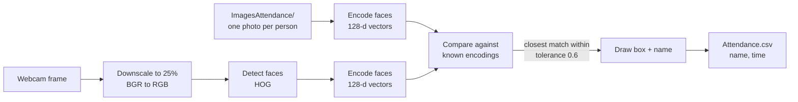

# Facial Recognition & Attendance System

A real-time, webcam-based attendance system built with Python, OpenCV and `face_recognition` (dlib). It learns faces from a folder of photos, recognises people live on camera, and logs each person's attendance to a CSV file — with a built-in playground of 14 OpenCV image filters.

## Features

- **Live face recognition** from the default webcam, with a labelled bounding box around every recognised face
- **Automatic attendance logging** to `Attendance.csv` (name + time), one entry per person
- **Zero training step** — add a photo named after a person to `ImagesAttendance/` and they're enrolled
- **Fast processing** — frames are downscaled to 25% before detection, then boxes are scaled back up
- **Image-processing playground** — switch between 14 OpenCV filters at runtime with a single key press (grayscale, histogram equalisation, blurs, edge detection, morphology, thresholding, sharpening)
- **Screenshot capture** with one key press
- **Helper scripts** for checking the camera and for a minimal two-image face comparison demo

## How it works



1. **Enrol** — at start-up every image in `ImagesAttendance/` is loaded and converted to a 128-dimensional face encoding. The file name (without extension) becomes the person's name.
2. **Capture** — each webcam frame is shrunk to 25% of its size and converted from BGR to RGB.
3. **Detect & encode** — `face_recognition` locates every face in the frame and computes an encoding for each.
4. **Match** — each encoding is compared with all known encodings. The one with the smallest Euclidean distance wins, provided it is within the library's default tolerance of `0.6`.
5. **Annotate & log** — a green box and the upper-cased name are drawn on the frame, and the name is written to `Attendance.csv` if it isn't already there.

## Tech stack

| Component | Purpose |
|---|---|
| Python 3.9+ | Language |
| [OpenCV](https://opencv.org/) (`opencv-python`) | Camera capture, drawing, image filters |
| [face_recognition](https://github.com/ageitgey/face_recognition) | Face detection, encoding and comparison |
| [dlib](http://dlib.net/) | Underlying face detector and deep-learning model |
| NumPy | Array maths and distance handling |

## Project structure

```
Facial-Recognition-Attendance-System/
├── AttendanceProject.py     # Main app: live recognition, attendance logging, filters
├── Basics.py                # Minimal demo: compare two images and print match + distance
├── camera.py                # Quick check that the webcam opens
├── Attendance.sample.csv    # Blank attendance template (copy to Attendance.csv)
├── ImagesAttendance/        # Your enrolment photos go here (contents are git-ignored)
├── requirements.txt
├── LICENSE
└── README.md
```

## Getting started

### 1. Clone

```bash
git clone https://github.com/<your-username>/Facial-Recognition-Attendance-System.git
cd Facial-Recognition-Attendance-System
```

### 2. Create a virtual environment

```bash
python3 -m venv .venv
source .venv/bin/activate        # Windows: .venv\Scripts\activate
```

### 3. Install dependencies

`face_recognition` depends on `dlib`, which is compiled during installation and needs **CMake** and a C++ compiler.

```bash
# macOS
brew install cmake
xcode-select --install           # if you don't already have the command line tools

# Ubuntu / Debian
sudo apt install cmake build-essential

# Windows: install CMake and the "Desktop development with C++" workload from Visual Studio Build Tools
```

Then:

```bash
pip install -r requirements.txt
```

### 4. Add people

Put one clear, front-facing photo per person in `ImagesAttendance/`. **The file name is the person's name.**

```
ImagesAttendance/
├── Jane Doe.jpg
└── John Smith.png
```

Use one face per photo, good lighting, and no sunglasses or heavy occlusion.

### 5. Create the attendance file

```bash
cp Attendance.sample.csv Attendance.csv
```

### 6. Check your camera (optional)

```bash
python camera.py
```

### 7. Run

```bash
python AttendanceProject.py
```

A window titled **Filter View** opens with the live feed. Recognised people get a green box and their name, and are added to `Attendance.csv`. Press `q` to quit.

> **macOS:** the first run will prompt for camera access for your terminal or IDE. If the camera won't open, check *System Settings → Privacy & Security → Camera*.

## Controls

Press these keys while the **Filter View** window is focused.

| Key | Action | Key | Action |
|---|---|---|---|
| `o` | Original image (with recognition overlay) | `c` | Canny edge detection |
| `g` | Grayscale | `l` | Laplacian edge detection |
| `e` | Histogram equalisation | `x` | Sobel X |
| `s` | Gaussian blur | `y` | Sobel Y |
| `m` | Median blur | `d` | Dilation |
| `b` | Bilateral filter | `r` | Erosion |
| `h` | Adaptive thresholding | `z` | Morphological gradient |
| `w` | Sharpening | `p` | Save screenshot (`screenshot_N.png`) |
| `q` | Quit | | |

Recognition always runs on the raw camera frame, so attendance keeps being logged in every filter mode. The name boxes are only drawn in the original view (`o`).

## Attendance output

`Attendance.csv` has one row per person:

```csv
Name,Time
JANE DOE,09:02:41
JOHN SMITH,09:05:13
```

A name is only written if it isn't already in the file. To start a new session, delete the rows below the header (or copy `Attendance.sample.csv` over `Attendance.csv` again).

## Other scripts

- **`camera.py`** — opens the default camera and reports whether it worked.
- **`Basics.py`** — encodes two images, draws the detected face on each, and prints whether they match along with the face distance (lower is more similar). Edit the two image paths at the top of the file to point at your own test images.

## Privacy

This project processes faces, which are biometric data. The repository deliberately **does not** include any enrolment photos, test images, screenshots or attendance records — those paths are in `.gitignore`. If you use this system with other people, get their consent first, store the photos and attendance file securely, and never commit them to a public repository.

## Known limitations

- Attendance rows store **time only**, not the date, and a person is logged once per file rather than once per day.
- Recognition uses a single photo per person; accuracy drops with extreme angles, poor lighting or masks.
- It is not liveness-aware — a printed photo or a phone screen can be recognised as a real person, so it is unsuitable for security-critical use.
- Only the default camera (index `0`) is used.

## Roadmap

- [ ] Date-stamped attendance with one entry per person per day
- [ ] Multiple enrolment photos per person
- [ ] Liveness / anti-spoofing check
- [ ] Configurable camera index and match tolerance
- [ ] Simple GUI or web dashboard for viewing attendance
- [ ] Export to Excel or a database

## Author

**Anjul Shukla**

## License

Released under the [MIT License](LICENSE).

## Acknowledgements

- [Adam Geitgey's `face_recognition`](https://github.com/ageitgey/face_recognition)
- [dlib](http://dlib.net/) by Davis King
- [OpenCV](https://opencv.org/)
