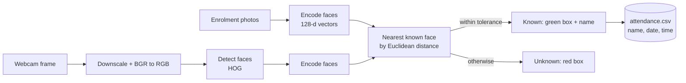

# Facial Recognition & Attendance System

[](https://github.com/ANJULS09/Facial-Recognition-Attendance-System/actions/workflows/ci.yml)
[](LICENSE)


**🚀 [Live demo: facial-recognition-attendance-syste-mocha.vercel.app](https://facial-recognition-attendance-syste-mocha.vercel.app)** — runs in your browser, nothing is uploaded.

A real-time, webcam-based attendance system built with Python, OpenCV and [`face_recognition`](https://github.com/ageitgey/face_recognition) (dlib). Enrol people by dropping their photos in a folder, point a camera at the room, and each recognised person is logged to a CSV file — once per day.

## Features

- **Live face recognition** from any webcam, with a green box and name on known faces and a red `UNKNOWN` box on strangers
- **Automatic attendance logging** to a CSV (`Name,Date,Time`) with one entry per person per day
- **No training step** — add a photo named after a person and they're enrolled; use a folder of photos for better accuracy
- **Fast** — frames are downscaled before detection, and recognition can run on every Nth frame
- **Configurable** — camera, match tolerance, detection scale, and file locations are all command-line options
- **Image-processing playground** — switch between 14 OpenCV filters live with a key press; recognition keeps working underneath
- **Browser version** that runs entirely client-side and deploys to Vercel
- **`report` command** to print attendance for a day or for all days
- **Tested and linted** — unit tests, Ruff, and GitHub Actions CI

## How it works



1. **Enrol** — every image in the enrolment folder becomes a 128-dimensional face encoding, labelled with the person's name.
2. **Detect & encode** — each camera frame is shrunk (default 25%), and every face found is encoded.
3. **Match** — an encoding is matched to the closest enrolled face, provided its distance is within the tolerance (default `0.6`; lower is stricter).
4. **Log** — a matched person is written to the attendance file the first time they're seen each day.

See [docs/ARCHITECTURE.md](docs/ARCHITECTURE.md) for the module-by-module breakdown.

## Installation

Requires **Python 3.10+**. `face_recognition` depends on `dlib`, which compiles during install and needs **CMake** and a C++ compiler:

```bash
# macOS
brew install cmake && xcode-select --install
# Ubuntu / Debian
sudo apt install cmake build-essential
# Windows: CMake + "Desktop development with C++" from Visual Studio Build Tools
```

Then:

```bash
git clone https://github.com/ANJULS09/Facial-Recognition-Attendance-System.git
cd Facial-Recognition-Attendance-System

python3 -m venv .venv
source .venv/bin/activate          # Windows: .venv\Scripts\activate

pip install -e .                   # installs the `face-attendance` command
```

## Usage

### 1. Enrol people

Put photos in `ImagesAttendance/`. **The name comes from the file or folder name.**

```
ImagesAttendance/
├── Jane Doe.jpg            # one photo  -> JANE DOE
└── John Smith/             # several photos -> JOHN SMITH
    ├── front.jpg
    └── side.png
```

Use clear, well-lit photos with one face each. Several photos per person (in a folder) improve accuracy. Supported formats: `.jpg`, `.jpeg`, `.png`, `.bmp`. Photos with no detectable face are skipped with a warning.

### 2. Run

```bash
face-attendance run
```

A window opens showing the live feed. People are logged to `data/attendance.csv` as they're recognised. Press **`q`** to quit.

> **macOS:** the first run asks for camera access for your terminal or IDE. If the camera won't open, check *System Settings → Privacy & Security → Camera*.

### 3. View attendance

```bash
face-attendance report                    # today
face-attendance report --date 2025-03-01  # a specific day
face-attendance report --all              # everything
```

The file itself is plain CSV:

```csv
Name,Date,Time
JANE DOE,2025-03-01,09:02:41
JOHN SMITH,2025-03-01,09:05:13
```

### Commands

| Command | What it does |
|---|---|
| `face-attendance run` | Live recognition and attendance logging |
| `face-attendance report` | Print attendance records |
| `face-attendance check-camera` | Confirm the webcam opens and show its resolution |
| `face-attendance compare A.jpg B.jpg` | Compare the first face in two images (match + distance) |

`python -m facial_attendance ...` works too. Add `-v` before the command for debug logging.

### Options for `run`

| Option | Default | Description |
|---|---|---|
| `--known-dir` | `ImagesAttendance` | Folder of enrolment photos |
| `--attendance-file` | `data/attendance.csv` | CSV log (created if missing) |
| `--screenshot-dir` | `screenshots` | Where `p` saves screenshots |
| `--camera` | `0` | Camera index |
| `--tolerance` | `0.6` | Max face distance for a match; lower is stricter |
| `--scale` | `0.25` | Frame scale for detection, `0`–`1`; higher is more accurate for small or distant faces but slower |
| `--process-every` | `1` | Recognise on every Nth frame to save CPU |

### Live controls

Press these while the video window is focused. The recognition overlay is drawn on top of every filter, and attendance is logged in every mode.

| Key | Action | Key | Action |
|---|---|---|---|
| `o` | Original | `c` | Canny edges |
| `g` | Grayscale | `l` | Laplacian edges |
| `e` | Histogram equalisation | `x` | Sobel X |
| `s` | Gaussian blur | `y` | Sobel Y |
| `m` | Median blur | `d` | Dilation |
| `b` | Bilateral filter | `r` | Erosion |
| `h` | Adaptive threshold | `z` | Morphological gradient |
| `w` | Sharpening | `p` | Save screenshot |
| `q` | Quit | | |

## Web version (Vercel)

The [`web/`](web) folder is a browser version of the same idea, deployed as a static site on [Vercel](https://facial-recognition-attendance-syste-mocha.vercel.app) — **[try it live](https://facial-recognition-attendance-syste-mocha.vercel.app)**. The visitor's browser reads their webcam and does the recognition itself with [face-api](https://github.com/vladmandic/face-api) (128-d face descriptors and the same `0.6` default tolerance), so **no photos or attendance data are uploaded anywhere**; everything is kept in the browser's local storage.

- Enrol people from photos or a camera snapshot, start the camera, and watch attendance fill in
- One entry per person per day, downloadable as CSV
- Delete all local data with one click

The desktop app (`face-attendance`) stays the full-featured version: it has the 14 OpenCV filters, screenshots, and the CLI. The Python app can't run on Vercel itself, because it needs a local camera window and `dlib`.

**Run it locally**

```bash
cd web
npm start            # serves web/public on http://localhost:3000
npm test             # unit tests for matching and attendance logic
```

**Deploy your own copy** — import this repository in Vercel and set **Root Directory** to `web` (no build command needed), or from a terminal:

```bash
cd web
npx vercel --prod
```

## Project structure

```
.
├── src/facial_attendance/
│   ├── cli.py            # `face-attendance` command and argument parsing
│   ├── app.py            # live webcam loop and on-screen drawing
│   ├── faces.py          # loads enrolment photos into face encodings
│   ├── recognizer.py     # detection + nearest-face matching
│   ├── attendance.py     # CSV attendance log
│   ├── filters.py        # the 14 OpenCV filters
│   ├── tools.py          # check-camera and compare helpers
│   └── config.py         # defaults
├── tests/                # pytest suite
├── web/                  # browser version (static site for Vercel)
│   ├── public/           # index.html, js/, css/, vendored face-api + models
│   ├── tests/            # node:test unit tests
│   └── vercel.json
├── docs/ARCHITECTURE.md
├── .github/workflows/    # CI
├── ImagesAttendance/     # your enrolment photos (git-ignored)
├── pyproject.toml
├── requirements.txt
└── requirements-dev.txt
```

## Development

```bash
pip install -e . -r requirements-dev.txt
pytest          # tests use a fake face backend, so they run without a camera
ruff check .    # lint
```

See [CONTRIBUTING.md](CONTRIBUTING.md) for more.

## Privacy

This project processes faces, which are biometric data. The repository deliberately does **not** include any enrolment photos, screenshots or attendance records; `ImagesAttendance/`, `data/` and `screenshots/` are git-ignored. If you use it with other people, get their consent first, store the photos and logs securely, and never commit them to a public repository.

## Limitations

- **Not spoof-proof** — there is no liveness check, so a printed photo or a phone screen can be recognised as a real person. Don't use it for security-critical access control.
- Accuracy drops with extreme angles, poor lighting, masks, or very small faces. Try `--scale 0.5` for people far from the camera.
- One camera at a time.

## Roadmap

- [ ] Liveness / anti-spoofing check
- [ ] Web dashboard for viewing attendance
- [ ] Export to Excel or a database
- [ ] Multiple cameras / video-file input

## Author

**Anjul Shukla**

## License

Released under the [MIT License](LICENSE).

## Acknowledgements

[face_recognition](https://github.com/ageitgey/face_recognition) by Adam Geitgey · [dlib](http://dlib.net/) by Davis King · [OpenCV](https://opencv.org/)
